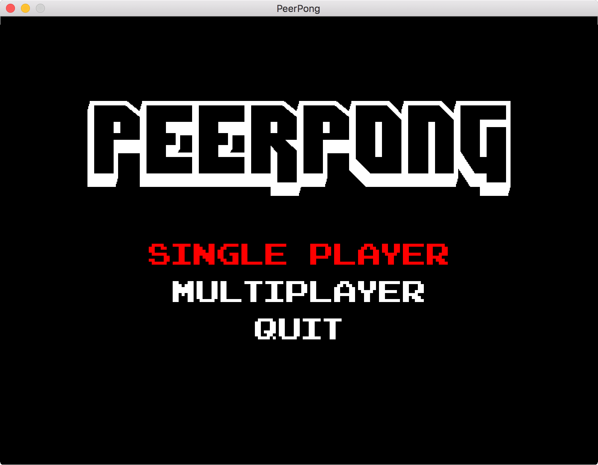
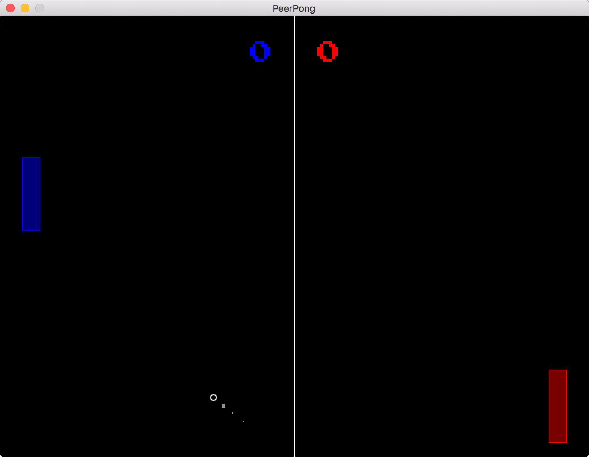

# PeerPong

PeerPong is a 'loose' remake of the classic arcade game, Pong. 

This project is for a networking project for a Systems Software class. My objective is to have a fully functional pong game that supports single player and multiplayer. The multiplayer functionality will be based on a client-server model. The modal will perform all game calculations and the clients will collect user input and render states to the screen.

### Reason For Project

I was assigned to give a simple presentation on network programming to my Systems Software class, based on our class textbook. Not having done any network programming prior to this project, I decided to assign myself a programming project in order to learn the material. I thought that implementing a simple arcade game and adding multiplayer functionality would be a fun project to complete and a fun way to show my classmates what can be done with basic C socket programming.

### Current Project Preview

Main Menu:

Single Player:

